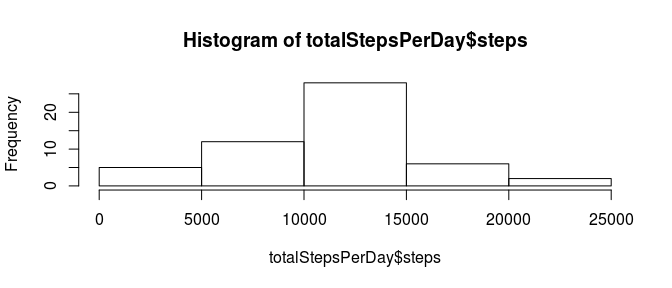
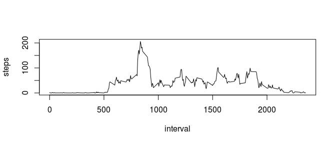
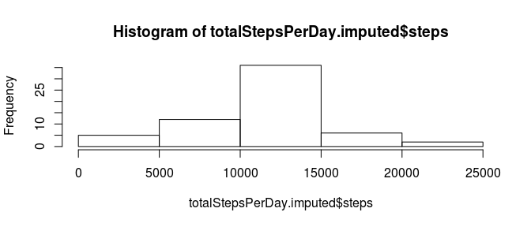
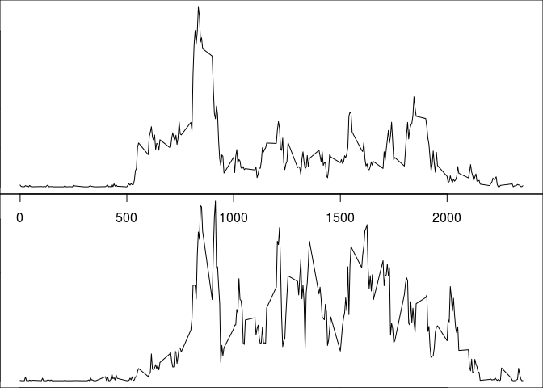

# Reproducible Research: Peer Assessment 1


## Loading and preprocessing the data

```r
unzip("activity.zip")
dataset = read.csv("activity.csv")
```
## What is mean total number of steps taken per day?


```r
totalStepsPerDay = aggregate(dataset[c("steps")],list(date=dataset$date),sum)
hist(totalStepsPerDay$steps)
```

 


```r
meansteps = mean(totalStepsPerDay$steps, na.rm=T)
mediansteps = median(totalStepsPerDay$steps,na.rm=T)
```

The mean total number of steps taken per day is 10766.19.

The median total number of steps taken per day is 10765.

## What is the average daily activity pattern?

```r
meanNA = function(...){mean(...,na.rm=T)}
meanStepsPerInterval = aggregate(dataset[c("steps")],list(interval=dataset$interval),meanNA)
plot(meanStepsPerInterval, type='l')
```

 


```r
meanStepsPerInterval[meanStepsPerInterval$steps==max(meanStepsPerInterval$steps),]
```

```
##     interval    steps
## 104      835 206.1698
```

The 5-minute interval which, on average across all the days in the dataset,
contains the maximum number of steps is 835.


## Imputing missing values

Number of missing values in dataset:

```r
sum(is.na(dataset$steps))
```

```
## [1] 2304
```

The imputation strategy I used for filling missng values is based on inserting mean value for given interval accross all days.


```r
selector = is.na(dataset$steps)
dataset.imputed = data.frame(dataset)
repeated = rep(meanStepsPerInterval$steps,times=nrow(totalStepsPerDay))
dataset.imputed$steps[selector] = repeated[selector]
```


```r
totalStepsPerDay.imputed = aggregate(dataset.imputed[c("steps")],list(date=dataset.imputed$date),sum)
hist(totalStepsPerDay.imputed$steps)
```

 


```r
meansteps = mean(totalStepsPerDay.imputed$steps)
mediansteps = median(totalStepsPerDay.imputed$steps)
```

The mean total number of steps taken per day is 10766.19.

The median total number of steps taken per day is 10766.19.

As we can see the impact of imputation on estimates is low. This is because of the imputation strategy which involved inserting mean values per interval and the fact that missing values are grouped (either whole day is missing or not).

## Are there differences in activity patterns between weekdays and weekends?

Add new factor column:

```r
weekends = function(x){
  weekday = weekdays(x)
  if(weekday == "sobota" || weekday == "niedziela"){ # saturday or sunday
      return("weekend")
  }
  return("weekday")
}
dataset.imputed$weekdays = as.factor(sapply(as.Date(dataset.imputed$date),weekends))
```

Panel plots comparing weekdays and weekends activity patterns.


```r
dataset.days = dataset.imputed[dataset.imputed$weekdays=="weekday",]
dataset.ends = dataset.imputed[dataset.imputed$weekdays=="weekend",]
meanStepsPerInterval.imputed.weekdays = aggregate(dataset.days[c("steps")],list(interval=dataset.days$interval),mean)
meanStepsPerInterval.imputed.weekends = aggregate(dataset.ends[c("steps")],list(interval=dataset.ends$interval),mean)
par(mfrow=c(2,1),mar=c(0,0,0,0))
plot(meanStepsPerInterval.imputed.weekdays, type='l')
plot(meanStepsPerInterval.imputed.weekends, type='l')
```

 
